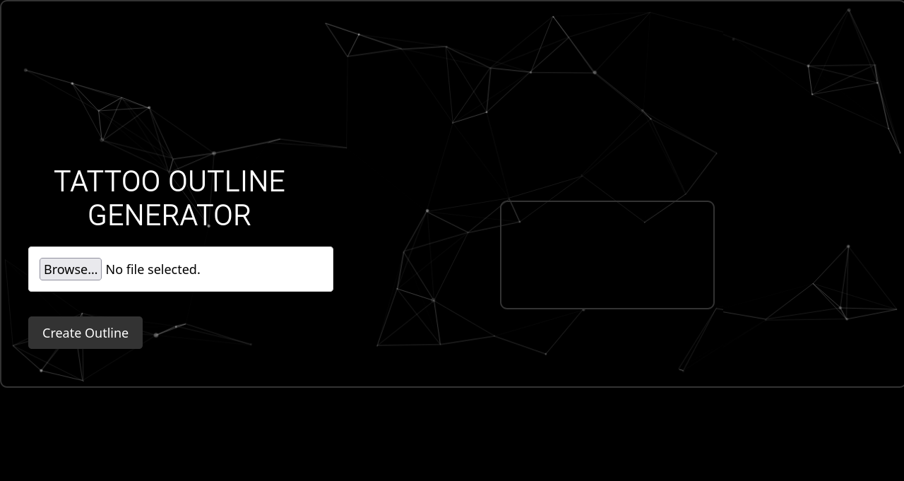

# Tattoo Outline Generator

A simple web-based tool that generates tattoo outlines from uploaded images. It uses Sobel edge detection to convert images into black and white outlines, which can then be saved as PNG files.

## Features
- **Image Upload**: Upload any image file (JPEG, PNG, etc.)
- **Outline Generation**: Uses Sobel edge detection to create tattoo outlines from the uploaded image.
- **Save the Image**: After generating the outline, you can save the image as a PNG file.

## How to Use
1. Clone this repository to your local machine or download the HTML file.
2. Open the HTML file in any modern browser (e.g., Chrome, Firefox).
3. Click on the **Choose File** button to upload an image from your computer.
4. Once the image is uploaded, click on **Create Outline** to generate the tattoo outline.
5. After the outline is created, you can click on the **Save Image** button to download the outline as a PNG file.

## Requirements
- No external software required; the tool works directly in the browser.
- A modern web browser with JavaScript support (e.g., Google Chrome, Firefox, Safari).

## Built With
- **HTML5**
- **CSS3** (for styling)
- **JavaScript** (for Sobel edge detection and interactive elements)
- **Particles.js** (for the background particle effects)

## License
This project is open-source and available under the MIT License.

## Acknowledgements
- Special thanks to [particles.js](https://vincentgarreau.com/particles.js/) for the particle background effect.
- The Sobel edge detection algorithm is used to generate the tattoo outlines.

## Screenshots

# Tattoo Outline Generator

Check out the live site: [Tattoo Outline Generator](https://tattoo-outline-generator.netlify.app)

